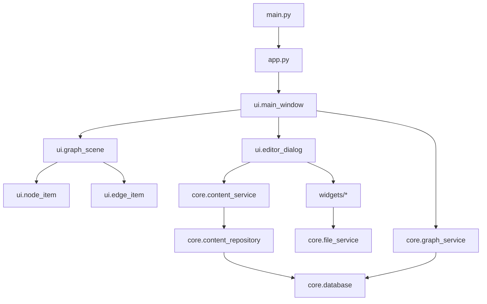
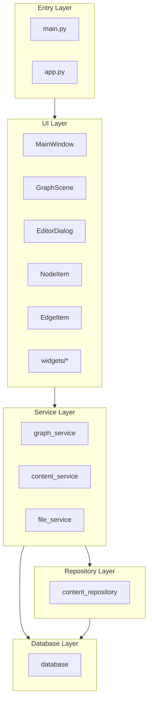
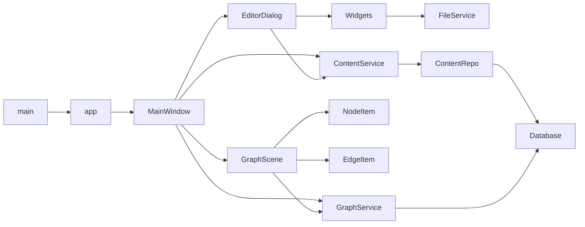

------------------------------------------------------------------------
ДИАГРАММА ЗАВИСИМОСТЕЙ ПРОЕКТА "КАРТА ЖИЗНИ"
------------------------------------------------------------------------
ЧАСТЬ ПРОЕКТА: Карта жизни (Альфа-версия 1.0)
АВТОР: vilfum
ЛИЦЕНЗИЯ: См. файл LICENSE
------------------------------------------------------------------------

# LifeMap — Dependency Diagram

Версия: Alpha 1.0
Тип: Layered Architecture
Стиль: Strict Dependency Direction

---

# 1. Основная диаграмма зависимостей (Layered)

---

# 2. Строгая диаграмма слоев

---

# 3. Полный граф зависимостей модулей

---